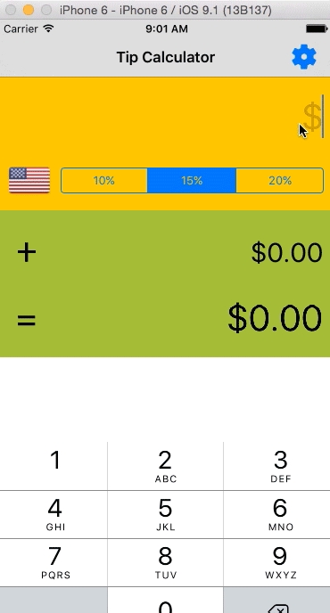

Tip Calculator
-- 
Manage your tip the easier way

Time spent: 2.5 hours

Completed
--

* [x] Required: User can enter a bill amount, choose a tip percentage, and see the tip and total values.
* [x] Required: Settings page to change the default tip percentage.
* [x] Optional: UI animations
* [x] Optional: Remembering the bill amount across app restarts (if <10mins)
* [x] Optional: Using locale-specific currency and currency thousands separators.
* [x] Additional: Making sure the keyboard is always visible and the bill amount is always the first responder. This way the user doesn't have to tap anywhere to use this app. Just launch the app and start typing.
* [x] Additional: Theming the Settings page like the main application page.
* [x] Additional: Also remembering the tip percentage across app restarts.

Additional
--
- Use enum `Tip` to abstract Tip management
- Display flag image for current locale
- Custom view controller transition animation
- Change amount resgion color to indicate value changed
- Save and load tip preference using `NSUserDefaults`
- Use `callback` block for `SettingViewController` instead of `Delegate` pattern for notifying tip prefrerence changed

Environment
--
- Xcode 7.1
- Swift 2.1
- Cocoapods 0.39.0

Dependencies
--
- FlatKit: for flag images
- BubbleTransition: for cool bubble presentation view controller transition
- Chameleon: for flat color

Demo
--

GIF created with [LiceCap](http://www.cockos.com/licecap/).
